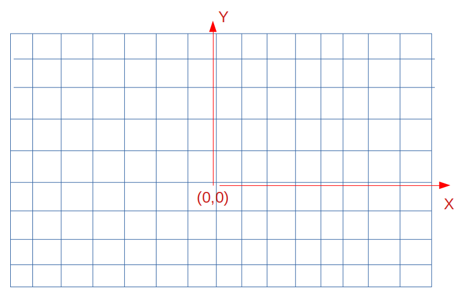

# EddyTheRobot

Create a program that takes in a string and associates each char with an instruction for the robot. The program should print out the position of the robot after processing all instructions to the terminal.

Objective
=====

Eddy is a robot and lives in a 2 dimensional world. All he can do is rotate and move forward.
He needs instructions to perform those actions.
There are 3 possible instructions, that Eddy understands 

* R: rotate right i.e. north -> east
* L: rotate left i.e. north -> west
* G: move a single grid unit in the direction of the heading 
i.e. heading: north and position: {"posX": 0, "posY": 0} -> new position: {"posX: 0, posY: 1}

More rules
====

* all instructions need to be uppercase letters
* Eddy starts at position: {"posX": 0, "posY": 0} 
* and starts with the heading: north
* he reports back his position as a json object with posX and posY after performing all actions

Example 1
=====

node index.js GGGLGRG

-> means Robot performs the following actions: moves forward 3 times, then rotates left, then moves forward, then rotates right, then moves forward

program output: { posX: -1, posY: 4 }

Example 2
=====

node index.js LGGRGGLGGLG

program output: { posX: -4, posY: 1 }

Example 3
=====

node index.js

progam output: { posX: 0, posY: 0 }

Example 4
=====

node index.js ABC

program output: Eddy does not understand that

code: console.log("Eddy does not understand that");

Example 5
=====

node index.js LGGRGGLGGLG ABC

program output: { posX: -4, posY: 1 }

Eddy will simply ignore the following input arguments after receiving his instructions

Grid
=====

